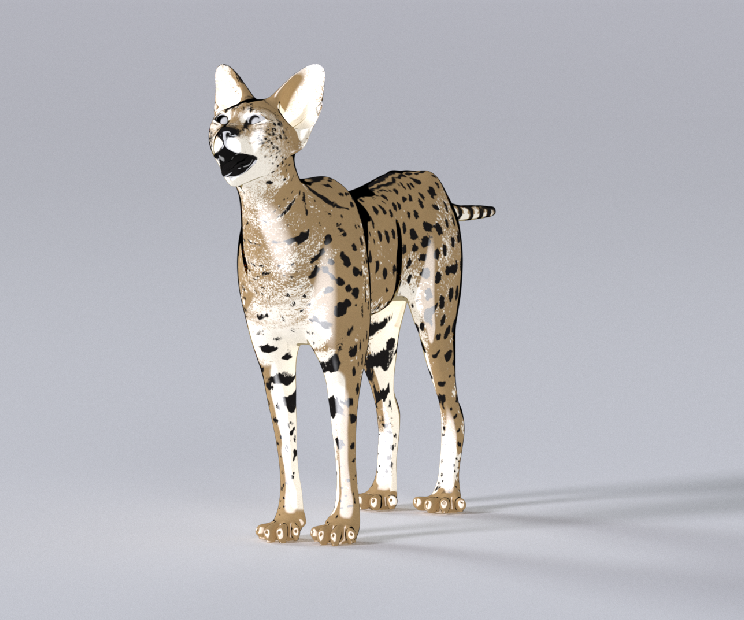

# OSLs
A little collection point for OSLs I have written.

## Fake Toon
Using fresnel approach to fake a toon shader. 
Give user control of the highlight and shadow (soft and sharp falloff, and cover area).
Just plug in a color map and voila.

